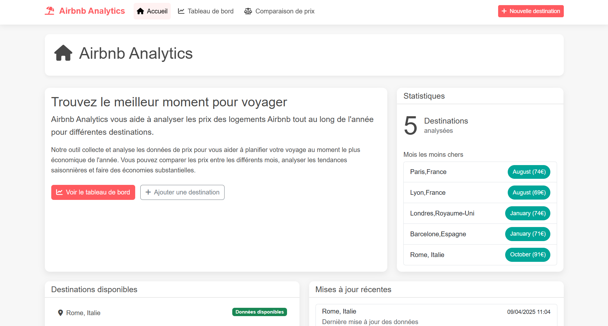
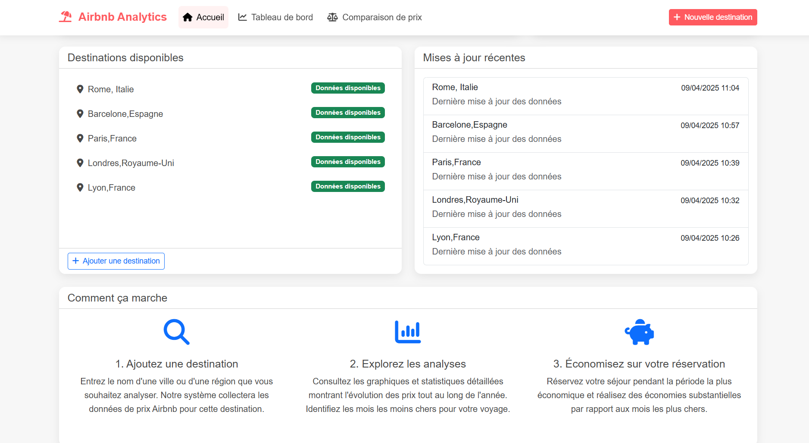
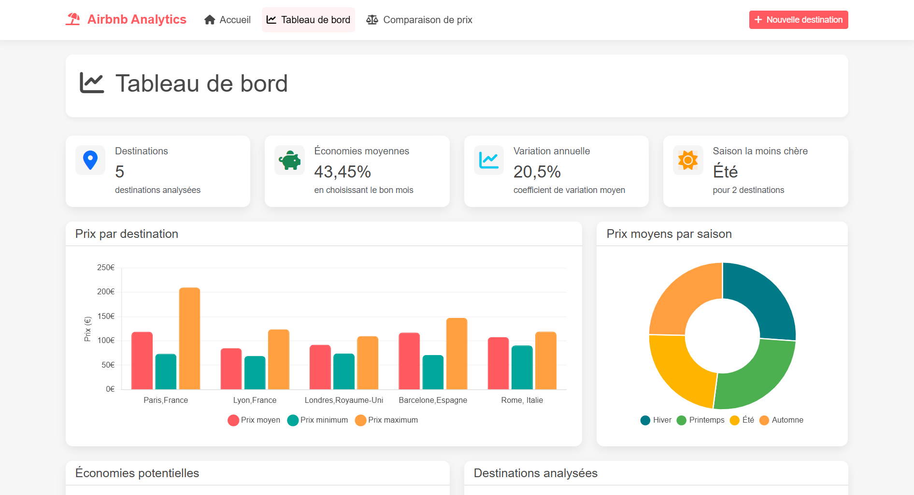
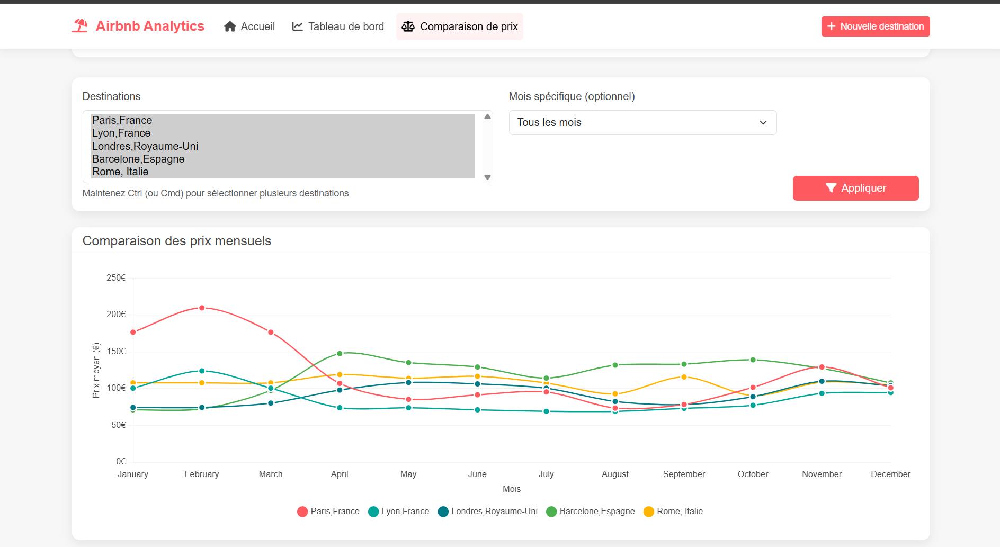

# Airbnb Analytics

Une application web Django pour analyser les prix Airbnb tout au long de l'année afin de trouver le meilleur moment pour voyager à différentes destinations.

## Fonctionnalités principales

- **Web scraping d'Airbnb** : Collecte automatisée des prix pour n'importe quelle destination sur une période de 12 mois
- **Analyse de données** : Traitement et analyse des données pour identifier les tendances, les saisons les moins chères, etc.
- **Tableau de bord interactif** : Visualisation des données avec des graphiques et tableaux
- **Comparaison de destinations** : Possibilité de comparer les prix entre plusieurs destinations
- **Alertes et logging** : Intégration de Sentry pour le suivi des erreurs et système de logging complet

## Captures d'écran






## Prérequis

- Python 3.8+
- Chrome/Chromium (pour le scraping avec Selenium)
- Pip (gestionnaire de paquets Python)
- Virtualenv (recommandé)

## Installation

1. **Cloner le dépôt**
   ```bash
   git clone https://github.com/votre-utilisateur/airbnb-analytics.git
   cd airbnb-analytics
   ```

2. **Créer et activer un environnement virtuel**
   ```bash
   python -m venv venv
   
   # Sur Windows
   venv\Scripts\activate
   
   # Sur macOS/Linux
   source venv/bin/activate
   ```

3. **Installer les dépendances**
   ```bash
   pip install -r requirements.txt
   ```

4. **Configurer les variables d'environnement**
   
   Créer un fichier `.env` à la racine du projet avec les variables suivantes :
   ```
   SECRET_KEY=votre-clé-secrète-django
   DEBUG=True
   SENTRY_DSN=votre-dsn-sentry
   ```

5. **Initialiser la base de données**
   ```bash
   python manage.py migrate
   ```

6. **Créer un super utilisateur** (optionnel)
   ```bash
   python manage.py createsuperuser
   ```

7. **Lancer le serveur de développement**
   ```bash
   python manage.py runserver
   ```

8. Accéder à l'application via http://127.0.0.1:8000/

## Utilisation

### Ajouter une destination

1. Cliquez sur "Nouvelle destination" dans la barre de navigation
2. Entrez le nom de la destination au format `Ville,Pays` (ex: `Paris,France`)
3. Validez le formulaire

### Lancer le scraping

1. Accédez à la page détaillée d'une destination
2. Cliquez sur le bouton "Mettre à jour les données"
3. Attendez que le scraping se termine

### Utiliser la ligne de commande

Vous pouvez également lancer le scraping via la ligne de commande :

```bash
# Pour une destination spécifique (par ID)
python manage.py run_scraper --destination 1

# Pour toutes les destinations
python manage.py run_scraper --all

# Pour exécuter les tâches planifiées
python manage.py run_scraper --scheduled
```

## Structure du projet

```
airbnb_analytics/
├── manage.py                # Script Django principal
├── airbnb_analytics/        # Configuration Django
├── scraper/                 # Module de scraping
├── analyzer/                # Module d'analyse de données
├── dashboard/               # Application Django pour le tableau de bord
├── logs/                    # Dossier pour les logs
└── data/                    # Dossier pour stocker les données
```

## Bonnes pratiques implémentées

- **Code modulaire** : Séparation claire des responsabilités (scraping, analyse, présentation)
- **Gestion des erreurs** : Système robuste avec retry, timeout et logging
- **Logging structuré** : Configuration avancée pour suivre facilement les problèmes
- **Intégration Sentry** : Suivi des erreurs en production
- **Tests** : Framework de test pour garantir la qualité (à implémenter)
- **Documentation** : Commentaires détaillés et README complet

## Aspects techniques

- **Scraping** : Utilisation de Selenium et BeautifulSoup pour une extraction fiable
- **Analyse de données** : Pandas et NumPy pour le traitement des données
- **Visualisation** : Chart.js pour des graphiques interactifs
- **Backend** : Django pour l'application web
- **Frontend** : Bootstrap 5 pour une interface responsive

## Limitations

- Le scraping d'Airbnb est sujet aux changements de leur site web et peut nécessiter des mises à jour
- Les résultats peuvent varier en fonction des filtres de recherche et de la disponibilité
- L'application n'est pas conçue pour un usage intensif qui pourrait être détecté comme du scraping abusif

## Contribution

Les contributions sont les bienvenues ! N'hésitez pas à ouvrir une issue ou une pull request.

## Licence

Ce projet est sous licence MIT. 
